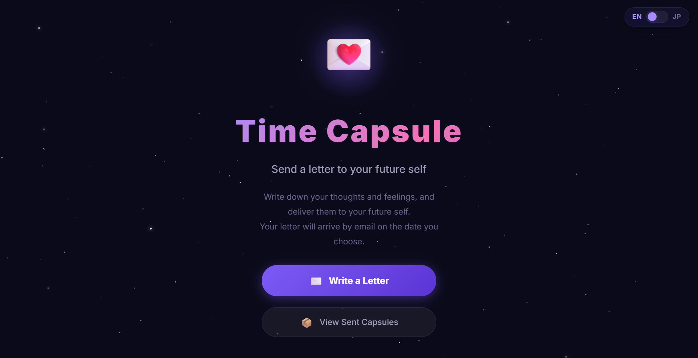

# 🕰️ Time Capsule

Send a letter to your future self. A time capsule app that delivers your message by email on the date you choose.

<div align="center">
  
  <br><br>
  <a href="https://timecapsule-app-shota.web.app">
    
  </a>
</div>

## ✨ Features

- **💫 Beautiful Design** — An immersive UI inspired by the cosmos and aurora
- **💌 Letters to the Future** — Write your current thoughts and have them delivered on a chosen date
- **📬 Automatic Email Delivery** — Your letter arrives at 9 AM on the specified date
- **🔒 Secure Storage** — Letters are safely sealed in the cloud (Firebase)
- **📱 Responsive** — Works great on both mobile and desktop

## 🛠️ Tech Stack

- **Frontend**: HTML5, CSS3 (Modern CSS), Vanilla JavaScript
- **Backend**: Firebase (Firestore, Cloud Functions, Hosting)
- **Deployment**: Firebase Hosting

## 🚀 How to Use

1. **Open the app**: Visit [https://timecapsule-app-shota.web.app](https://timecapsule-app-shota.web.app)
2. **Write a letter**: Tap "Write a Letter" and enter your message and delivery date
3. **Seal it**: Press the send button to seal your capsule
4. **Wait**: Your letter stays sealed until the chosen date
5. **Receive it**: On that day, your letter arrives in your inbox 📩

## 💻 Development Setup

Follow these steps to run this repository locally.

### Prerequisites

- Node.js (v18 or higher)
- Firebase account
- Gmail account (for sending emails)

### Installation

1. **Clone the repository**
   ```bash
   git clone https://github.com/imshota1009/timecapsule.git
   cd timecapsule
   ```

2. **Install dependencies**
   ```bash
   npm install -g firebase-tools
   cd functions
   npm install
   ```

3. **Set up environment variables**
   Create a `functions/.env` file with the following settings:
   ```env
   GMAIL_USER=your-email@gmail.com
   GMAIL_APP_PASSWORD=your-app-password
   ```

4. **Configure Firebase project**
   ```bash
   firebase login
   firebase use --add
   ```

5. **Deploy**
   ```bash
   firebase deploy
   ```

## ⚠️ Notes

- To use Cloud Functions (automatic email delivery), you need Firebase's **Blaze plan (pay-as-you-go)** (free tier available).
- For local testing only, the Spark plan (free) works, but the email delivery feature will not function.

## 🤝 Contributing

Bug reports and feature suggestions are welcome! Please create an Issue or send a Pull Request.

## 📄 License

MIT License
